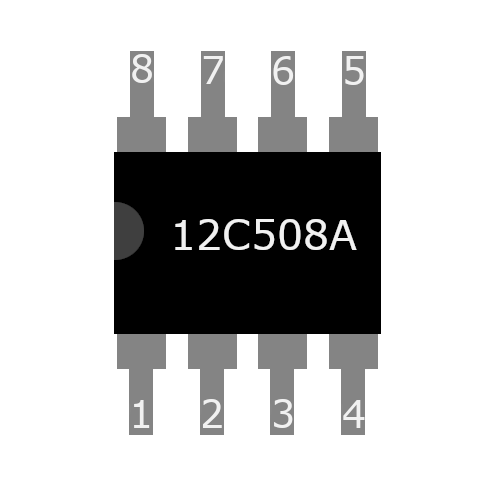
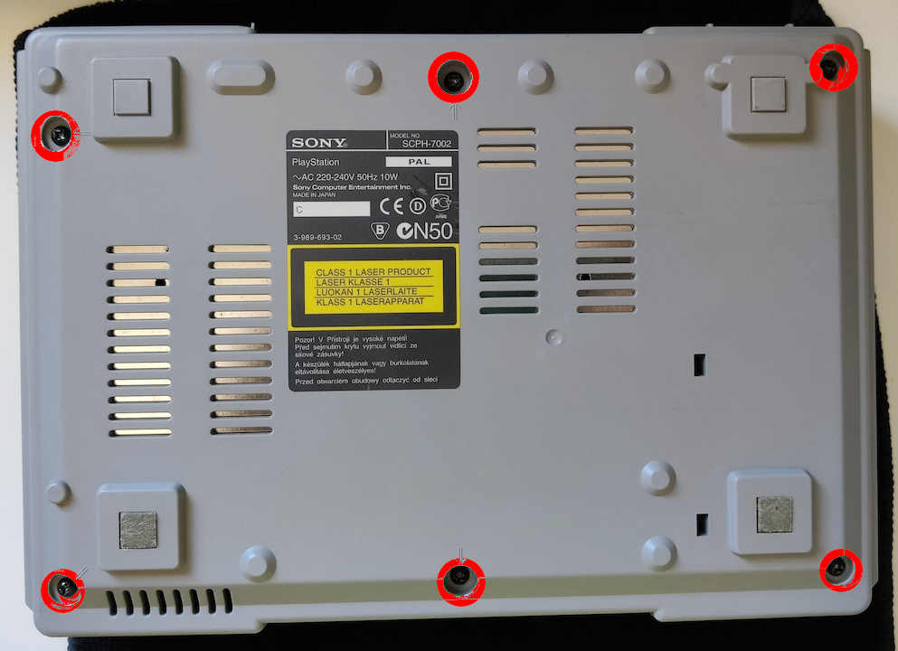
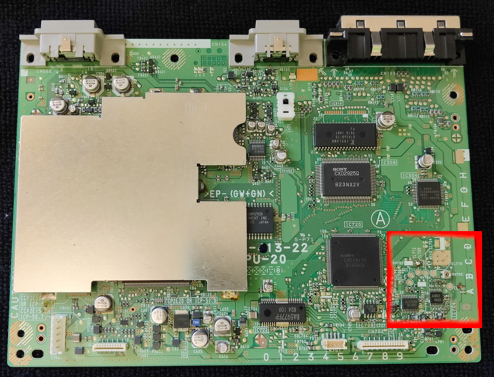
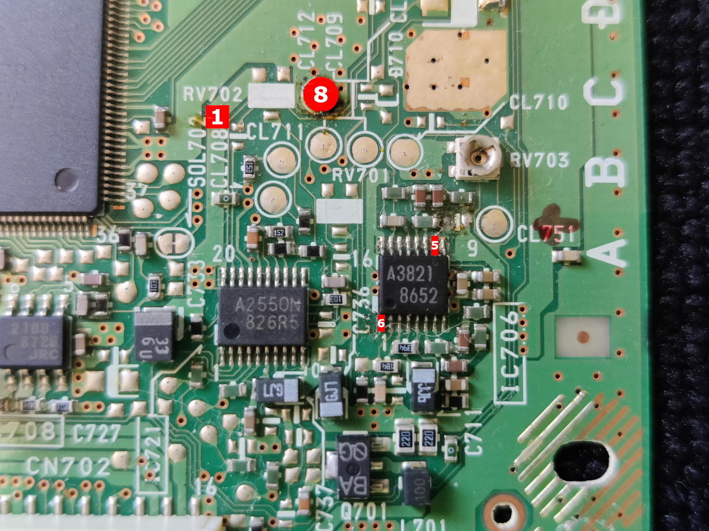

**Diagrama de instalación del chip 12C508A para la Playstation SCPH-7002, PAL**

Necesitamos grabar el código .hex en el chip 12c508a (*importante no confundir con el 12c508*), podemos grabar la versión normal "modchip_12c508a.hex" o el modo stealth "stealth_12c508a.hex" para juegos japoneses.

   

Desmontamos la consola, retirando los 6 tornillos de la carcasa.

   
   
Localizamos el área de la placa donde vamos a colocar el chip
   
   
   
Puntos a soldar, se recomienda soldador de no mas de 14W con estaño de 1mm y flux. 

   

Repasar las soldaduras a la inversa, ten cuidado de no calentar mucho el chip ya que lo puedes quemar. 

:warning: *La modificación de la consola, anula cualquier garantía que pudiera tener, y solo es responsable el propietario de la consola, el uso de copias de juegos ilegales no es legal en muchos países, este tutorial se ha realizado a modo informativo, el autor no se hace responsable del mal uso que se le pueda dar.*

